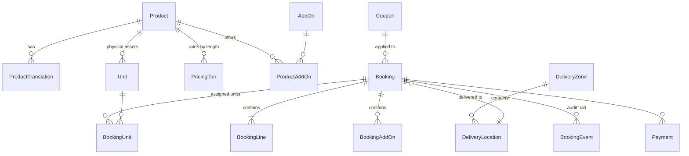

# Architecture — Orlando Up

Written 2026-09-04 (conversation 1), before any code exists. Decisions are numbered in
`Docs/decisions.md`; this file says how they fit together. When code and this file disagree, the
code is measured and this file is corrected — never the other way around.

## 1. What the system is

A bilingual (en-US / pt-BR) rental storefront plus an operations back-office for a fleet of
mobility scooters, wheelchairs and strollers delivered to hotels and vacation homes around the
Orlando theme parks. Customers pick dates and a delivery location, see live availability and
price, pay in full with Stripe, and receive a confirmation with a "manage my booking" link. Staff
see today's deliveries and pickups, assign physical units, and handle changes and refunds.

Three runtime surfaces on one ASP.NET Core host:

| Surface | Route root | Technology | Audience |
|---|---|---|---|
| Public site + checkout | `/`, `/pt/` | Razor Pages, server-rendered, progressive enhancement | customers, search engines |
| Back-office | `/admin` | Razor Pages behind Identity (`Admin`, `Staff`) | Rod and the delivery team |
| API | `/api/v1` | Minimal APIs, JSON, versioned | future PWA/native app, integrations, webhooks (`/api/webhooks/stripe`) |

## 2. Solution layout (D10, D11)

```
Orlando-UP/
├── OrlandoUp.sln
├── src/OrlandoUp.Web/
│   ├── Domain/            entities, enums, value objects, domain rules — references nothing else
│   ├── Application/       use-cases and interfaces (IBookingService, IAvailabilityService,
│   │                      IPricingService, IPaymentGateway, IEmailSender, IClock) — no EF, no Stripe
│   ├── Infrastructure/    EF Core (AppDbContext, configurations, migrations), Stripe adapter,
│   │                      Brevo/SMTP e-mail, blob storage, clock
│   ├── Pages/             Razor Pages: public, Checkout/, Manage/, Admin/, Shared/
│   ├── Api/               Minimal API endpoint groups + webhooks
│   ├── Resources/         .resx string resources (SharedResource, per-page where needed)
│   ├── wwwroot/           css/site.css (design tokens), js/ (small, no framework), img/
│   ├── Program.cs
│   └── appsettings.json   shape + non-secret defaults only (D24)
├── tests/OrlandoUp.Tests/ xUnit: architecture, domain rules, availability, pricing, localization parity
├── Docs/                  this folder (see CLAUDE.md for the map)
├── .githooks/pre-commit   secret scan, encoding guard, build
└── .github/workflows/     ci.yml (build + test); deploy-*.yml arrive in the go-live leva
```

The architecture test in `tests/` enforces: `Domain` references no other layer; `Application`
never references `Infrastructure` or `Pages`; `Pages` and `Api` reach the database only through
`Application` services **or** read-only queries on `AppDbContext` (allowed, pragmatic — writes go
through services so that booking invariants live in one place).

## 3. Domain model (v1)



| Entity | Purpose and key fields |
|---|---|
| `Product` | Rentable model. `Slug`, `Category` (`MobilityScooter`, `Wheelchair`, `Stroller`), `Configuration` (`Single`, `Double`, `Triple`, `Infant`, or null), `MaxRiderWeightLb`, `WidthIn`, `LengthIn`, `SeatWidthIn`, `RangeMiles`, `FitsDisneyTransport` (derived: ≤ 30 × 48), `TurnaroundDays` (buffer between rentals, default 0), `IsActive`, `SortOrder`, `ImagePath`. |
| `ProductTranslation` | `(ProductId, Culture)` unique. `Name`, `Tagline`, `Description` (Markdown, sanitized on render), `Highlights` (JSON list). One row per supported culture; missing row = English fallback, never a blank. |
| `Unit` | One physical asset. `AssetTag` (unique, printed on the unit), `SerialNumber`, `Status` (`Available`, `Maintenance`, `Retired`), `Notes`, `PurchasedOn`. Rented/not-rented is **derived** from bookings, never stored. |
| `PricingTier` | Per product. `MinDays`, `MaxDays` (null = open), `Mode` (`FlatPerRental` or `PerDay`), `Amount`. Example: 1–2 days flat 89; 3–6 days 32/day; 7+ days 27/day. |
| `AddOn` + `ProductAddOn` | Accessories and services: cup holder, cane holder, sunshade, basket, rain cover, damage waiver. `PricingMode` (`PerRental`, `PerDay`), `Amount`, `RequiresQuantity`. |
| `DeliveryZone` | `Name`, `Kind` (`DisneyResort`, `UniversalResort`, `HotelOrResort`, `VacationHome`, `Other`), `DeliveryFee`, `HandoverMode` (`MeetAndGreet`, `FrontDesk`, `Doorstep`), `SalesTaxRate` (decimal, configurable per zone — see open question on tax), `IsActive`. |
| `DeliveryLocation` | Curated hotel/resort list with `ZoneId`, `Name`, `Address`, `Notes` ("meet at the bus loop") so customers pick from a list; free-text address allowed for vacation homes with zone chosen by staff rule (v1: customer picks "vacation home" zone). |
| `Booking` | `Number` (`OU-YYYY-NNNNNN`, sequential, never reused), `Status`, `Culture`, customer fields (`FirstName`, `LastName`, `Email`, `Phone`, `WhatsApp`, `Country`), `DeliveryLocationId` + `RoomOrAddress` + `Notes`, `StartDate`/`EndDate` (`DateOnly`, Orlando), `DeliveryWindow`/`PickupWindow` (`TimeOnly` start–end), money: `Subtotal`, `AddOnsTotal`, `DeliveryFee`, `Discount`, `Tax`, `Total` (all `decimal(10,2)` USD), `CouponId`, `WaiverAcceptedAtUtc` + `WaiverVersion` + `WaiverIp`, `ManageToken` (random 32 bytes, base64url), `CreatedAtUtc`, `ExpiresAtUtc` (draft/pending only). |
| `BookingLine` | `ProductId`, `Quantity`, `Days`, `TierApplied` (snapshot), `UnitPrice`, `LineTotal`. Prices are **snapshotted** — later price changes never alter a paid booking. |
| `BookingAddOn` | `AddOnId`, `Quantity`, `Amount` snapshot. |
| `BookingUnit` | `(BookingId, UnitId)` — assigned at delivery prep by staff; a unit cannot be assigned to two overlapping bookings (service rule + DB unique filtered index on active assignments). |
| `Payment` | `Provider` (`Stripe`), `CheckoutSessionId`, `PaymentIntentId`, `Amount`, `Status` (`Pending`, `Succeeded`, `Refunded`, `PartiallyRefunded`, `Failed`), `RefundedAmount`, `ReceivedAtUtc`, raw event id for idempotency. |
| `BookingEvent` | Append-only: `Type`, `AtUtc`, `Actor` (customer/staff/system), `Data` (JSON). Feeds the admin timeline and support. |
| `Coupon` | `Code` (unique, case-insensitive), `Kind` (`Percent`, `Fixed`), `Value`, `ValidFrom`/`ValidTo` (calendar dates), `MaxUses`, `Uses`, `MinDays`, `IsActive`. |

**Booking status machine.** `Draft` → `PendingPayment` (Stripe Checkout session created) →
`Confirmed` (webhook `checkout.session.completed`) → `Scheduled` (units assigned) →
`OutForDelivery` → `Active` (handed over) → `PickedUp` → `Completed`. Side exits: `Expired`
(pending session timed out, inventory released), `Cancelled` (by customer before cut-off or by
staff; refund per policy), `Refunded`. Every transition writes a `BookingEvent`; illegal
transitions throw in the domain, not in the page.

**Availability.** For product *P*, dates *[start, end]* and quantity *q*: `available =
activeUnits(P) − max over each day d in [start − turnaround, end + turnaround] of Σ quantity of
bookings in {PendingPayment, Confirmed, Scheduled, OutForDelivery, Active} whose padded interval
contains d`. `q ≤ available` or the product shows "sold out for these dates". Pending sessions hold
inventory for 30 minutes (`ExpiresAtUtc`), released by a background sweeper. Per-unit assignment
happens later and never changes availability math.

**Pricing.** `Days = EndDate − StartDate + 1` (a rental from the 10th to the 14th is 5 days —
state this on the page). Tier chosen by `Days`; `FlatPerRental` tiers ignore `Days` in the
multiplication. Line total × quantity; add-ons by their mode; coupon on the subtotal + add-ons;
delivery fee from the zone; tax = rate × (taxable base) where the base and the rate are zone
configuration (open question: whether medical scooter rentals are taxable). All rounding
`MidpointRounding.ToEven` at 2 decimals, once, at the end of each line.

## 4. Localization (D8, D20, D21)

- Route: `{culture?}` prefix on every public page via a `PageRouteModelConvention`; `""` = `en-US`,
  `pt` = `pt-BR`. The prefix is the **only** signal that changes language on public pages; a
  cookie-based `RequestCultureProvider` is allowed for `/admin` (staff preference).
- `RequestLocalizationOptions`: `SupportedCultures = [en-US]`, `SupportedUICultures = [en-US, pt-BR]`,
  default `en-US`. Formatting never switches; strings do.
- Strings: `IStringLocalizer<SharedResource>` + `Resources/SharedResource.pt-BR.resx`. A test
  asserts every key in the English resource exists in `pt-BR` (and vice versa) so a missing
  translation fails the build, not the customer.
- Content: `ProductTranslation`, FAQ and guides tables carry a `Culture` column; render falls back
  to `en-US` and logs a warning.
- Layout emits `<html lang="…">`, `<link rel="alternate" hreflang="en">`/`"pt-BR"`/`"x-default">`,
  and a language switcher that keeps the current page.
- E-mails and PDFs use the booking's `Culture`, not the request's.

## 5. Payments (D7)

1. Customer confirms the review page → `IBookingService.StartCheckout` creates the `Booking`
   (`PendingPayment`, `ExpiresAtUtc = now + 30 min`) and a Stripe Checkout Session with
   `client_reference_id = Booking.Number`, `success_url = /checkout/success?b={Number}&t={token}`,
   `cancel_url = /checkout/cancel?…`, line items in cents, customer e-mail prefilled, locale from
   the booking culture.
2. Stripe hosts the payment page (card, Apple Pay, Google Pay, Link).
3. Webhook `POST /api/webhooks/stripe` verifies the signature, is **idempotent on event id**,
   and on `checkout.session.completed` marks the booking `Confirmed`, records the `Payment`, and
   enqueues the confirmation e-mail. The success page only *shows* state; the webhook *changes* it.
4. Refunds: admin action → Stripe refund API → `Payment.RefundedAmount` → status.
5. Test mode keys in local/staging; live keys only in the production App Service settings.

## 6. Notifications

`IEmailSender` (Brevo SMTP via MailKit first). Templates are Razor views rendered to HTML, per
culture: booking confirmation (with manage link, delivery window, meet-and-greet instructions,
what to bring), reminder the day before delivery, pickup reminder, receipt/refund, and staff
alerts. All outbound e-mail goes through an `EmailOutbox` table and a background sender so a
webhook never waits on SMTP and a failed send can be retried and audited. WhatsApp: click-to-chat
links in v1; API later if volume justifies.

## 7. Back-office

`/admin` pages: today (deliveries and pickups by window, with phone and location), bookings
(search, detail with timeline, change dates/location, assign units, refund, resend e-mail),
calendar (occupancy per product), catalog (products, translations, tiers, add-ons, images),
zones and locations, coupons, units and maintenance, content (FAQ, guides), settings (company
data — D3). Every write goes through an `Application` service and produces a `BookingEvent` or an
`AuditLog` row.

## 8. API

`/api/v1`: `GET /products?culture=`, `POST /quotes` (dates + location + lines → price and
availability), `POST /bookings` (creates pending booking, returns checkout URL), `GET
/bookings/{number}?token=`. Same services as the pages. Rate-limited, JSON problem details,
OpenAPI document generated by .NET 10. The PWA (later) and any native app talk only to this.

## 9. Environments and configuration (D13, D14, D24)

| | Local | Staging | Production |
|---|---|---|---|
| Host | `dotnet run`, ports fixed in `launchSettings.json` | App Service Linux B1 `app-orlandoup-stg` | App Service Linux `app-orlandoup-prod` |
| DB | LocalDB `OrlandoUpDb` | Azure SQL Basic `sqldb-orlandoup-stg` | Azure SQL `sqldb-orlandoup-prod` |
| Stripe | test keys (user-secrets) | test keys | live keys |
| E-mail | allow-list of recipients, everything else logged only | same allow-list | real |
| Config source | user-secrets | App Service settings | App Service settings |

Settings shape (`appsettings.json`): `Company` (D3), `Localization`, `Stripe` (publishable key only;
secret + webhook secret are secrets), `Email` (host/port/sender; password is a secret),
`Storage`, `Booking` (hold minutes, cut-off hours, delivery windows), `Seo`.

## 10. Security and compliance

Stripe Checkout keeps card data off our servers (PCI SAQ-A). HTTPS only, HSTS, secure cookies,
anti-forgery on every form, honeypot + rate limiting on public forms, Identity with lockout and
optional passkeys for staff, `ManageToken` compared in constant time, webhook signature
verification, no PII in logs, data retention setting for completed bookings. Privacy policy and
terms are versioned documents; the waiver version accepted is stored on the booking.

## 11. Accessibility, SEO, performance

WCAG 2.2 AA: 16 px+ base, 4.5:1 contrast, visible focus, skip link, labelled inputs, error
summaries, no information by colour alone, reduced-motion respected. SEO: server-rendered HTML,
`hreflang`, canonical, `sitemap.xml` per culture, JSON-LD `LocalBusiness` + `Product` + `FAQPage`,
Open Graph, image `alt`s from translations. Performance: no JS framework, WebP images with
explicit sizes, response compression, output caching for catalog pages, Application Insights.

## 12. Brand and UI direction (v0 — to be validated with the mock-up)

Name: **Orlando Up**. Voice: warm, plain, reassuring ("Keep up with your family, rest when you
want"). Palette (tokens in `site.css`): sun orange `#F26B1D` for action, deep sky blue `#0F4C81`
for trust, warm off-white `#FFF9F2` background, ink `#1F2933`, success green `#1B7F4B`. Type:
Nunito (headings, friendly rounded) + system sans (body), 18 px body on desktop. Imagery: real
fleet photos at real hotels, people of all ages, never stock "hospital" imagery. Components:
big date/location picker, product cards with capacity badge and "fits Disney buses" pill, sticky
price summary in checkout, large tap targets.

## 13. Testing and quality gates

Unit tests for pricing tiers, availability with turnaround, status machine, coupon rules;
architecture test; localization parity test; integration tests with SQLite in-memory or
Testcontainers SQL for `AppDbContext` queries; Playwright smoke test of the booking flow in the
go-live leva; `Docs/controles/*.tsv` invariants measured by `Docs/medir-controles.sh` at the end
of every front; `.githooks/pre-commit` runs the secret scan, the encoding guard and `dotnet build`.

## 14. Deployment

GitHub Actions: `ci.yml` on every push (restore, build, test); `deploy-staging.yml` on `main`;
`deploy-production.yml` manual (`workflow_dispatch`) with the same artifact. Migrations are
applied by a separate, explicit step (`dotnet ef database update` from the workflow with a
scoped connection string or by Rod from SSMS) **before** the app deploys. Custom domain and
managed certificate on App Service; DNS at the registrar (open question which). The
`gate-de-deploy-azure` skill runs before every publish.
